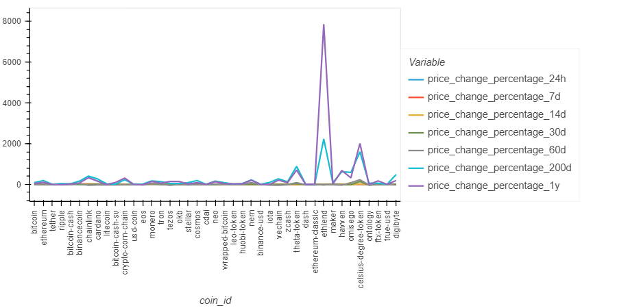
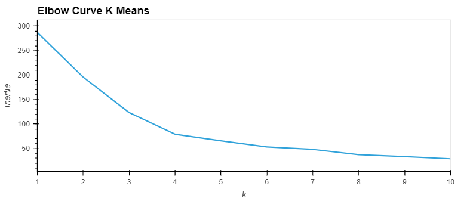
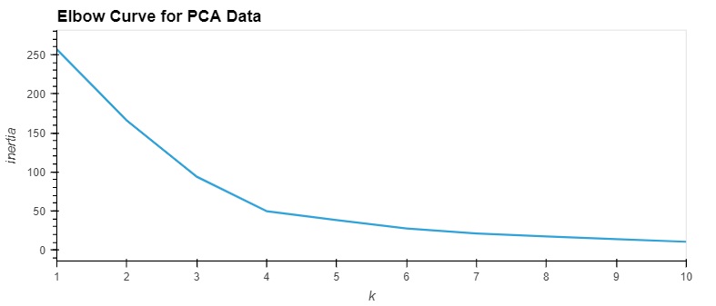
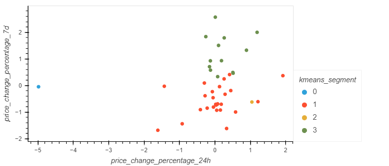
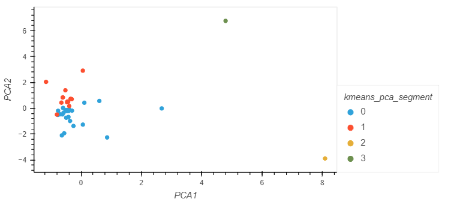

## Module 10 Application: Cryto Clustering (Images)
 

### This file contains all the assignment images/visuals from the Jupyter lab.

 

**Plot of the data in the Dataframe**

 

**Elbow curve using original data**

**Elbow curve using PCA data**

 

### Comparing Clusters using original data and PCA data

